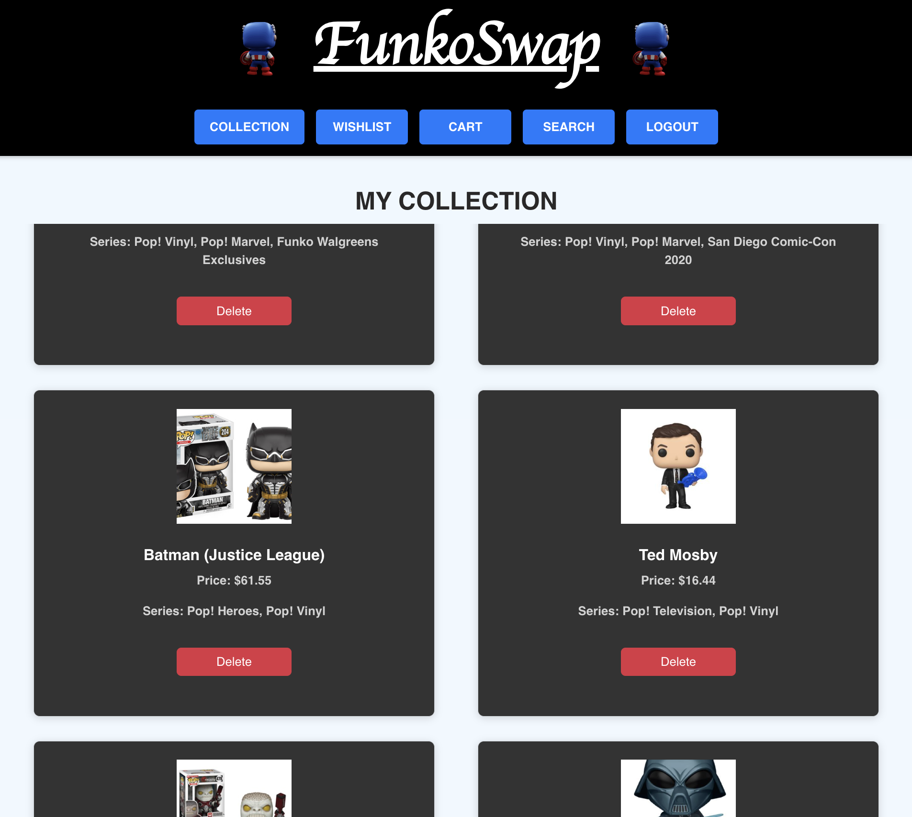
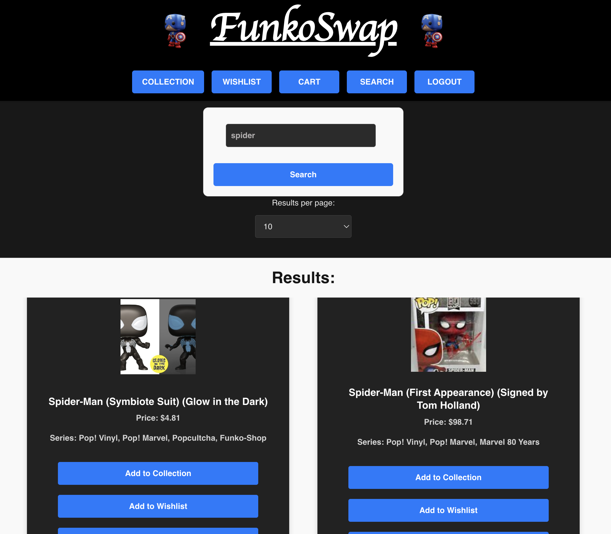

# FunkoSwap

## Description

FunkoSwap brings together Funko enthusiasts into a centralized platform that where they add Funkos to their collection, sell funkos of their choice and peruse others' collections to others' Funkos. Currently, our database is filled with a library of over 10,000 Funkos for users to select and add to their personal collection, wishlist, and if they choose, their sales page where they can sell to other interested Funko enthusiasts. Stay tuned for future developments!

## Table of Contents

- client

  - src
    - components
      - Content
        - Login
          - Login.css
          - Login.jsx
          - loginForm.jsx
        - MyFunkos
          - MyFunkoCollection
            - MyFunkoCollection.css
            - MyFunkoCollection.jsx
          - MyFunkoSale
            - MyFunkoSale.css
            - MyFunkoSale.jsx
          - MyFunkoWishlist
            - MyFunkoWishlist.css
            - MyFunkoWishlist.jsx
        - OtherFunkos
          - OtherCollections
            - OtherCollections.css
            - OtherCollections.jsx
          - OtherSales
            - OtherSales.css
            - OtherSales.jsx
        - Search
          - Search.css
          - Search.jsx
        - signUp
          - signUpForm.css
          - signUpForm.jsx
        - utils
          - auth.js
          - mutations.js
          - queries.js
      - Footer
        - Footer.css
        - Footer.jsx
      - Header
        - Header.css
        - Header.jsx
      - ProtectedRoutes.jsx
    - App.css
    - App.jsx
    - index.css
    - main.jsx
  - .gitignore
  - eslint.config.js
  - index.html
  - package.json
  - vite.config.js

- public

  - images

- server

  - config
    - connection.js
  - models
    - category.js
    - funko.js
    - index.js
    - user.js
    - wishlist.js
  - schemas
    - index.js
    - resolvers.js
    - typeDefs.js
  - utils
    - auth.js
  - .env
  - .gitignore
  - package.json
  - server.js

  - package.json
  - README.md

## Tasks

- WHEN I launch the application on render, THEN I am directed to the login/sign-up page
- WHEN I enter the credentials required for signing up, THEN I am able to sign in
- WHEN I enter invalid information, THEN I receive warning messages to re-enter valid credentials or valid user login criteria
- WHEN I login, THEN I am directed to the Search page and can simultaneously view the navigation bar on the Header under the title
- WHEN I enter a search query and press 'search', THEN I am brought search results for the respective query or I am notified that there are no results that match my query
- WHEN I view a Funko search result, THEN I am presented with three buttons to add the Funko to either my collection, wishlist, or cart
- WHEN I click a button the Funko from the search result, THEN I see a message indicating that the Funko has been added to the respective component
- WHEN I click the collection, wishlist, or cart button on the navigation bar of the Header, THEN the middle component re-renders to display Funkos the user added to its respective component
- WHEN I view Funkos on the collection, wishlist, or cart component, THEN I see a button to DELETE the Funko if I choose to delete the Funko
- WHEN I view Funkos on the wishlist component, THEN I see a button to add the Funko to cart
- WHEN I click the LOGOUT button on the navigation bar, THEN my session is terminated and I am prompted to return back to the screen

## Usage

- Here what a user's collection looks like:
  

- Here is what the search component looks like:
  

## Links

- Deployed Webpage: https://funkoswap.onrender.com
- GitHub Repo Page: https://github.com/ImNeeeks/FunkoSwap/

## Credits

- Front-End
  - React: https://www.npmjs.com/package/react
  - Vite: https://www.npmjs.com/package/vite
  - React Router: https://www.npmjs.com/package/react-router-dom
  - ES Lint: https://www.npmjs.com/package/eslint
  - Bootstrap: https://www.npmjs.com/package/bootstrap
- Back-End
  - GraphQL: https://www.npmjs.com/package/graphql
  - JSON Web Token: https://www.npmjs.com/package/jsonwebtoken
  - Apollo: https://www.npmjs.com/package/@apollo/client
  - Express: https://www.npmjs.com/package/express
  - Funko Database with JSON format: https://github.com/kennymkchan/funko-pop-data
  - Dave's reformatted Funko Database: https://github.com/davehyler/Group-4-s-Funko-Inventory/
- Instructor Teaching Assistants, and Tutors
  - Farish Kashefinejad
  - Erik Hirsch
  - Anthony Barragan
  - Alexis San Javier

## License

MIT License

Copyright (c) 2024 scurvyirv

Permission is hereby granted, free of charge, to any person obtaining a copy of this software and associated documentation files (the "Software"), to deal in the Software without restriction, including without limitation the rights to use, copy, modify, merge, publish, distribute, sublicense, and/or sell copies of the Software, and to permit persons to whom the Software is furnished to do so, subject to the following conditions:

The above copyright notice and this permission notice shall be included in all copies or substantial portions of the Software.

THE SOFTWARE IS PROVIDED "AS IS", WITHOUT WARRANTY OF ANY KIND, EXPRESS OR IMPLIED, INCLUDING BUT NOT LIMITED TO THE WARRANTIES OF MERCHANTABILITY, FITNESS FOR A PARTICULAR PURPOSE AND NONINFRINGEMENT. IN NO EVENT SHALL THE AUTHORS OR COPYRIGHT HOLDERS BE LIABLE FOR ANY CLAIM, DAMAGES OR OTHER LIABILITY, WHETHER IN AN ACTION OF CONTRACT, TORT OR OTHERWISE, ARISING FROM, OUT OF OR IN CONNECTION WITH THE SOFTWARE OR THE USE OR OTHER DEALINGS IN THE SOFTWARE.
